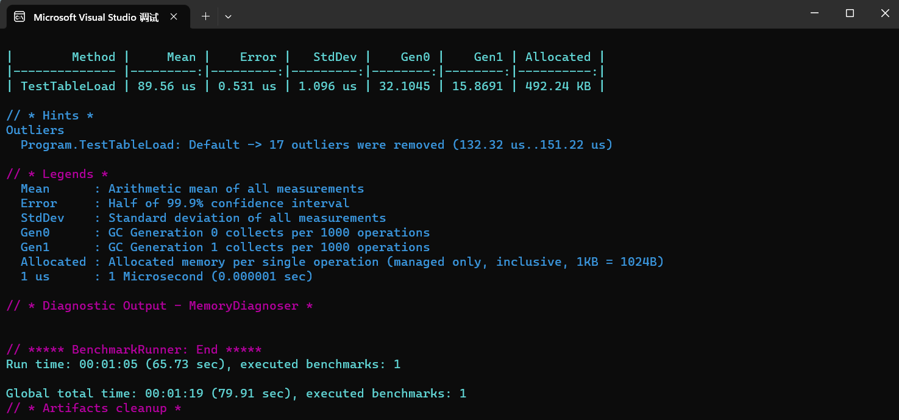
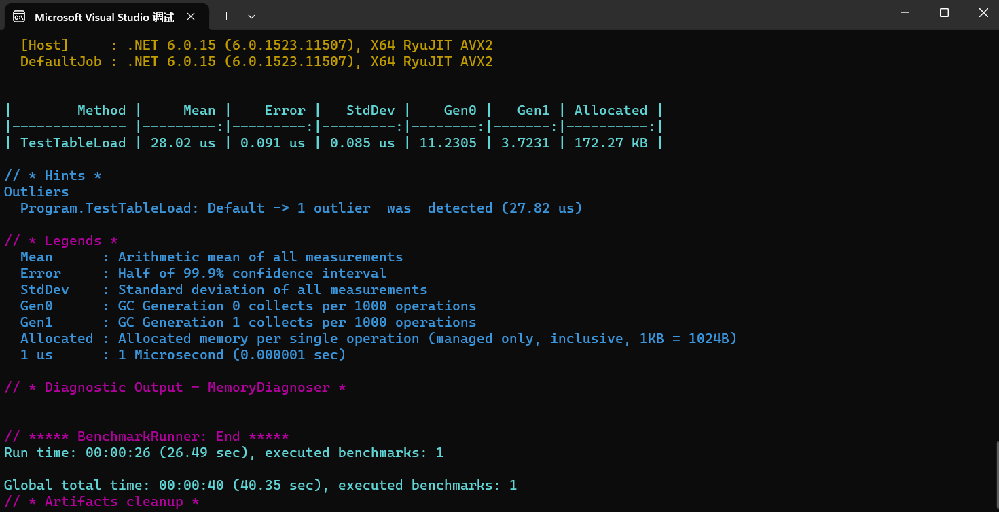

# table-export

## 介绍
table-export 是一个高性能游戏导表工具，使用golang编写，目前支持源数据excel和csv，导出格式支持

C# binary （推荐），lua （推荐），c# proto，json，可以根据自己的需求自己修改扩展。

## [B站介绍视频](https://www.bilibili.com/video/BV1ru411871G/)

## 核心特性

- 高性能，方便扩展
- 支持集成进lua热更项目、C# HybridCLR热更项目
- 使用toml配置来定义导出规则
- 支持多字段索引id，例如多个字段才确定这行数据的唯一
- 导出的C# binary，以及lua，都是支持内存和硬盘占用优化，这是对比其他导表工具的最大优势。table-export会在导出的时候把相同重复的引用数据只导出一份，并且在runtime读取的时候，只读取一份，然后其他和这份数据相同的都会持有这个引用，实际上游戏数据表越多数据量越大的时候，能够优化的存储和内存将近一半，这样也同时也加快了游戏启动的加载的时间

## 使用方法

### 准备环境

1. 安装golang，编译可执行文件。或者从release里下载可执行文件
2. 把可执行文件放到examples目录下
3. 工具的配置文件目录为可执行文件的相对路径的./conf/config.toml，examples里已经有一份示例配置
4. 先在config.toml里面配置好导出规则的配置，例如c# binary

```toml
[[meta.rules]]
    rule_name = "cs_bin"
    config_dir = "./cs_bin_meta"
    [meta.rules.cs_bin]
        code_temp_dir = "./temp_work/temp_cs_bin_code"
        data_temp_dir = "./temp_work/temp_cs_bin_data"
        gen_code_dir = "./projects/proj_cs_bin/src/gen"
        data_bin_dir = "./projects/proj_cs_bin/table_bytes"
        #toml支持多行文本
        gen_code_head = """using Serialization;
        """
        code_namespace = "CfgTable"
        # 以下是生成的优化相关数据
        gen_optimize = true
        optimize_threshold = 0.2
```

5. 上述配置中config_dir对应的目录是表的描述文件，一般其他的导表工具会定义在excel头部，但是table-export会使用单独的meta配置来控制表的导出规则等。这样可以在由程序来控制配置表如何输出，而不用让策划帮忙改表的定义，减少了这方面的沟通。

### 开始导表

table_export.exe -m 模式1|模式2|...

例如： `table_export.exe -m cs_bin` 

可以同时导出多种

例如 :  `table_export.exe -m lua|cs_bin` 

### **表meta配置文件**

#### 介绍

meta配置指一个表的导出规则，控制哪些字段导出，字段类型，字段注释，索引的key等规则，例如以下就是对应base_test表的导出规则

```toml
# 目标名字
target = "base_test"
mode = ""
source_type = "excel"

sources = [
    { file_name = "base_test.xlsx",    sheet_name = "Sheet1" },
]


fields = [
    { active = true,   sname = "id" ,      tname = "id" ,      type = "int" ,  		key = 1,    desc = "主id"},
    { active = true,   sname = "name" ,    tname = "name" ,    type = "string",  	key = 0,    desc = "名字"},
    { active = true,   sname = "age" ,     tname = "age" ,     type = "int" ,  		key = 0,    desc = "年龄"},
	{ active = true,   sname = "course" ,  tname = "course" ,  type = "[]int" ,  		key = 0,    desc = "学科"},
]

```

#### 生成meta模板

> table-export提供了根据配置好的excel文件生成一份meta模板的配置，然后在这个基础上做修改，而不是从零自己去写这个配置，以下就是生成模板meta配置的方法

先把excel文件放在config.toml中定义src_dir对应的目录下，当前示例定义的目录是examples/excels

excel 生成meta模板，例如: `table_export -g 目标名字,excel文件名字带后缀,Sheet名` 

```shell
table_export -g complex_test,complex_test.xlsx,Sheet名
```

csv 生成meta模板同理excel，只是参数变成了两个

```shell
table_export -g csv_test,csv_test.csv
```

#### 使用该meta模板配置，并修改

生成之后会在config.toml里的gen_dir配置项中，示例配置定义的目录为examples/temp_meta里，使用上述生成meta模板文件的命令之后，会在这个目录看到文件，需要把生成的文件放到定义的导出规则的目录中去。例如config.toml里的cs_bin的配置中的config_dir字段定义的C#的二进制的导表读取的meta目录为examples/cs_bin_meta里，这样就放到这个目录中。

然后打开这个toml配置，把fields中需要导出的字段的active设置为true，并且填入type，以及在这个表中至少定义一个索引key，可以多个但是必须是连续的，例如 key的字段有 1 ，2。这样就会生成一个双key的数据，之后就是双key的数据。例子complex_test就是双key的例子


## Benchmark

使用cs_bin模式，用examples中的big_data作为benchmark的示例

**关闭优化时**



**开启优化后**



**可以看到读取时间以及内存占用都大幅降低了**

# TODO

在1.0版本中会加入数据检测，自定义复合类型，自定义枚举，特殊后处理等功能。


## Credits

- [LuaTableOptimizer](https://github.com/lujian101/LuaTableOptimizer) 使用了lua表优化工具，在此基础上做了更进一步的优化
- [luban](https://github.com/focus-creative-games/luban) 使用了二进制序列化的代码和一些思路